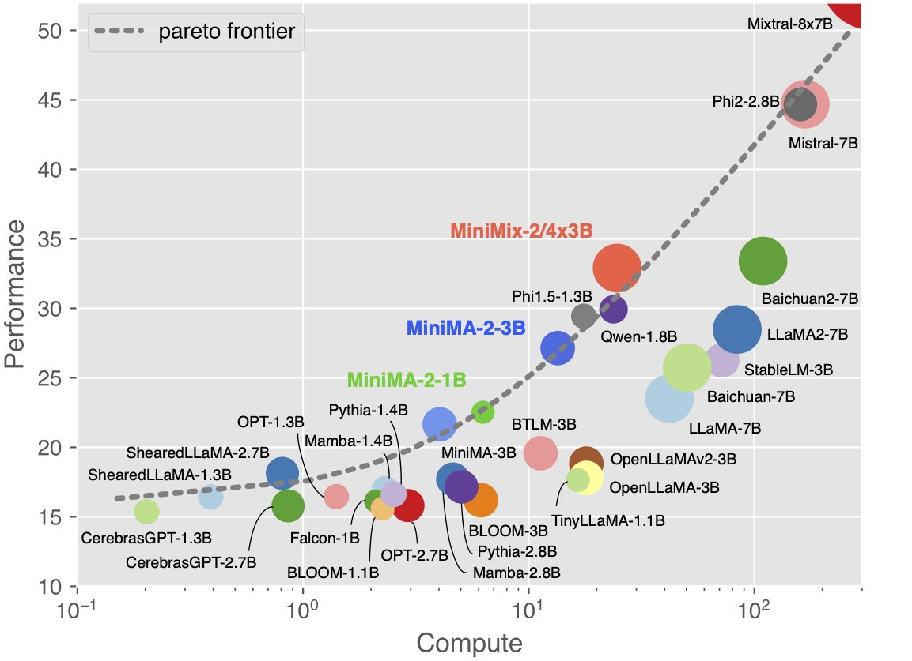
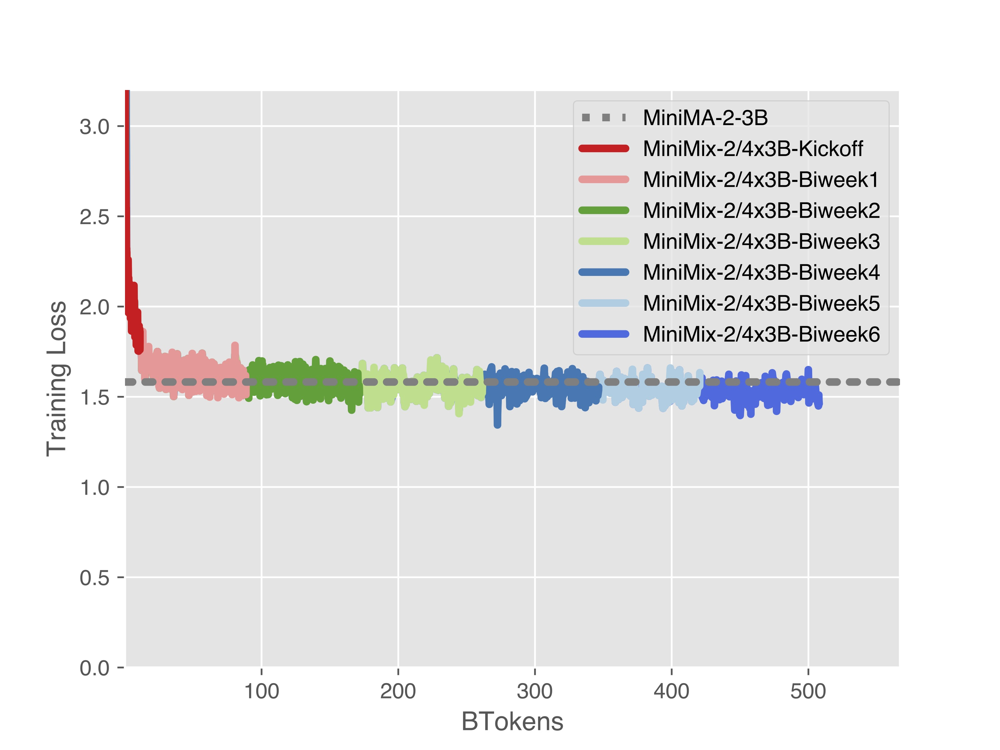

# 🪄 Towards the Law of Capacity Gap in Distilling Language Models

<p align="center">
<br>
Logo for MiniMA designed with DALL·E
</p>

📑 [arXiv](https://arxiv.org/abs/2311.07052) | 👻 [GitHub](https://github.com/GeneZC/MiniMA) | 🤗 [HuggingFace-MiniMA](https://huggingface.co/GeneZC/MiniMA-3B) | 🤗 [HuggingFace-MiniChat](https://huggingface.co/GeneZC/MiniChat-3B) | 🤖 [ModelScope-MiniMA](https://modelscope.cn/models/GeneZC/MiniMA-3B) | 🤖 [ModelScope-MiniChat](https://modelscope.cn/models/GeneZC/MiniChat-3B) | 🤗 [HuggingFace-MiniChat-1.5](https://huggingface.co/GeneZC/MiniChat-1.5-3B) | 🤗 [HuggingFace-MiniMA-2](https://huggingface.co/GeneZC/MiniMA-2-3B) | 🤗 [HuggingFace-MiniChat-2](https://huggingface.co/GeneZC/MiniChat-2-3B)

Language model (LM) distillation is a trending area that aims to distil the knowledge resided in a large teacher LM to a small student one. While various methods have been proposed to push the distillation to its limits, it is still a pain distilling LMs when a large capacity gap is exhibited between the teacher and the student LMs. The pain is mainly resulted by the curse of capacity gap, which describes that a larger teacher LM cannot always lead to a better student LM than one distilled from a smaller teacher LM due to the affect of capacity gap increment. That is, there is likely an optimal point yielding the best student LM along the scaling course of the teacher LM. Even worse, the curse of capacity gap can be only partly yet not fully lifted as indicated in previous studies.

However, the tale is not ever one-sided. Although a larger teacher LM has better performance than a smaller teacher LM, it is much more resource-demanding especially in the context of recent large LMs (LLMs). Consequently, instead of sticking to lifting the curse, leaving the curse as is should be arguably fine. Even better, in this paper, we reveal that the optimal capacity gap is almost consistent across different student scales and architectures, fortunately turning the curse into the law of capacity gap. The law later guides us to distil a 3B student LM (termed MiniMA) from a 7B teacher LM (adapted LLaMA2-7B). MiniMA is demonstrated to yield a new compute-performance pareto frontier among existing 3B LMs on commonly used benchmarks, and its instruction-tuned version (termed MiniChat) outperforms a wide range of 3B competitors in GPT4 evaluation and could even compete with several 7B chat models. 

<p align="center">
 
</p>

<p align="center">
 
</p>

## 🔗 Quick Links

- [Updates](#%EF%B8%8F-updates)
- [Live](#-live)
- [Performance](#-performance)
- [Quick Start](#-quick-start)
- [Tutorials](#-tutorials)
- [Future Work](#-future-work)
- [Bugs or Questions?](#%EF%B8%8F-bugs-or-questions)
- [Citation](#-citation)

## 🕰️ Updates

[2024/1/3] [MT-Bench-ZH](./mt_bench_zh) is released to serve as a Chinese counterpart of multi-turn instruction-following evaluaion (e.g., MT-Bench). MT-Bench-ZH is essentially translated from MT-Bench by GPT-4 and further checked by human. On the MT-Bench-ZH, MiniChat-2-3B surpasses Qwen-Chat-1.8B and approximates Qwen-Chat-7B. And it indicates MiniChat-2-3B has a better bilingual ability than others (e.g., Phi-2, StableLM-Zephyr-3B, etc.).

[2023/12/29] MiniMA-MoE is kicked off, aiming at upcycling MiniMA-2-3B to an MoE model. Following the [Pyramid-MoE](https://www.microsoft.com/en-us/research/blog/deepspeed-advancing-moe-inference-and-training-to-power-next-generation-ai-scale/) design, MiniMA-MoE has the bottom 25% MLPs with 2 experts while the top 75% MLPs with 4 experts, reaching ~7B parameters in total. Top-1 gating is used to preserve 3B activated parameters per token. The progress would be updated in a biweekly schedule (totally 6 biweeks as estimated) and could be tracked in [Live](#-live). We later decide to name it as MiniMix to show our respect to Mixtral.

[2023/12/27] Performance results are added for potential references in [Performance](#-performance). Still room for improvement, bravo!

[2023/12/27] MiniMA-2-3B and MiniChat-2-3B are successfully landed. MiniMA-2-3B is continued from MiniMA-3B with a more diverse data sources in Chinese, and MiniChat-2-3B are finetuned and optimized on a range of instruction and preference data. MiniMA-2-3B together with MiniMA-3B and other arts completes the new compute-performance pareto frontier, and MiniChat-2-3B achieves a score of 6.23 on [MT-Bench](https://huggingface.co/spaces/lmsys/chatbot-arena-leaderboard), surpassing Vicuna-7B and approximating LLaMA-2-Chat-7B.

[2023/11/27] MiniChat-1.5-3B (MiniChat-3B enhanced with NEFTune and DPO) achieves a win rate of 78.55 on AlpacaEval Leaderboard : ) Keep going! However, we have found a mistake in our MiniChat-3B submission. And the mistake should be [fixed](https://github.com/tatsu-lab/alpaca_eval/pull/176). MiniChat-3B instead achieves a win rate of 48.82 and can surpass ChatGLM2 but not Davinci-003.

[2023/11/16] MiniChat-3B achieves a win rate of ~~76.94~~ 48.82 on [AlpacaEval Leaderboard](https://tatsu-lab.github.io/alpaca_eval/), ~~surpassing Vicuna-7B v1.3 and~~ leaving large room for improvement.

[2023/11/15] Wait, what!? MiniMA-2 is on the way! Just stay tuned ; ) The release is scheduled at the begining of year 2024 and hopefully it could be timely.

[2023/11/14] For models <= 3B on [Open LLM Leaderboard](https://huggingface.co/spaces/HuggingFaceH4/open_llm_leaderboard), MiniMA-3B surpasses ShearedLLaMA-2.7B and ranks #14, and MiniChat-3B (potentially with unidentified data contamination) surpasses Phi1.5 and ranks #2.

[2023/11/14] We have released the paper, uploaded the checkpoints, and updated the codebase.

## 📺 Live

> MiniMA-MoE-2/4x3B (a.k.a. MiniMix)

**Training Losses**



**Evaluation Metrics**

||TFLOPs|MMLU (5-shot)|CEval (5-shot)|DROP (3-shot)|HumanEval (0-shot)|BBH (3-shot)|GSM8K (8-shot)|
|--|--|--|--|--|--|--|--|
|LLaMA-MoE-v1-3.5B-4_16|84.0+4.2E9|26.69|24.67|23.40|6.10|30.26|5.38|
|DeepSeek-MoE-16B-base|33.6E|44.64|39.90|29.74|26.83|31.95|17.06|
|Phixtral-2x2.8B|159.9E9|53.91|32.24|32.28|47.56|44.29|58.53|
||
|MiniMA-2-3B|13.4E9|40.14|44.65|23.10|14.63|31.43|8.87|
|MiniMA-MoE-2/4x3B-Kickoff|+0.3E9|33.71|33.66|20.80|9.76|29.35|6.07|
|MiniMA-MoE-2/4x3B-Biweek1|+1.6E9|32.17|35.59|20.48|9.15|30.10|5.91|

## 📊 Performance

**Standard Benchmarks**

|Method|TFLOPs|MMLU (5-shot)|CEval (5-shot)|DROP (3-shot)|HumanEval (0-shot)|BBH (3-shot)|GSM8K (8-shot)|
|--|--|--|--|--|--|--|--|
|Mamba-2.8B|4.6E9|25.58|24.74|15.72|7.32|29.37|3.49|
|ShearedLLaMA-2.7B|0.8E9|26.97|22.88|19.98|4.88|30.48|3.56|
|BTLM-3B|11.3E9|27.20|26.00|17.84|10.98|30.87|4.55|
|StableLM-3B|72.0E9|44.75|31.05|22.35|15.85|32.59|10.99|
|Qwen-1.8B|23.8E9|44.05|54.75|12.97|14.02|30.80|22.97|
|Phi-2-2.8B|159.9E9|56.74|34.03|30.74|46.95|44.13|55.42|
|LLaMA-2-7B|84.0E9|46.00|34.40|31.57|12.80|32.02|14.10|
||
|MiniMA-3B|4.0E9|28.51|28.23|22.50|10.98|31.61|8.11|
|MiniChat-3B|4.0E9|38.40|36.48|22.58|18.29|31.36|29.72|
|MiniMA-2-3B|13.4E9|40.14|44.65|23.10|14.63|31.43|8.87|
|MiniChat-2-3B|13.4E9|46.17|43.91|30.26|22.56|34.95|38.13|

**Instruction-following Benchmarks**

|Method|AlpacaEval|MT-Bench|MT-Bench-ZH|
|--|--|--|--|
|GPT-4|95.28|9.18|8.96|
|Zephyr-7B-Beta|90.60|7.34|6.27<sup>#</sup>|
|Vicuna-7B|76.84|6.17|5.22<sup>#</sup>|
|LLaMA-2-Chat-7B|71.37|6.27|5.43<sup>#</sup>|
|Qwen-Chat-7B|-|-|6.24|
|Phi-2-DPO|81.37|-|1.59<sup>#</sup><sup>$</sup>|
|StableLM-Zephyr-3B|76.00|6.64|4.31<sup>#</sup>|
|Rocket-3B|79.75|6.56|4.07<sup>#</sup>|
|Qwen-Chat-1.8B|-|-|5.65|
||
|MiniChat-3B|48.82|-|-|
|MiniChat-2-3B|77.30|6.23|6.04|

<sup>#</sup> specialized mainly for English.

<sup>$</sup> finetuned without multi-turn instruction data.

## ✨ Quick Start

Since MiniMA and MiniChat follow architecture of LLaMA, they can be seamlessly used in HuggingFace Transformers with minimal requirements.

The following is an example code snippet to use MiniMA and MiniChat:

```python
import torch

from transformers import AutoModelForCausalLM, AutoTokenizer

# MiniMA
tokenizer = AutoTokenizer.from_pretrained("GeneZC/MiniMA-2-3B", use_fast=False)
# GPU.
model = AutoModelForCausalLM.from_pretrained("GeneZC/MiniMA-2-3B", use_cache=True, device_map="auto", torch_dtype=torch.float16).eval()
# CPU.
# model = AutoModelForCausalLM.from_pretrained("GeneZC/MiniMA-2-3B", use_cache=True, device_map="cpu", torch_dtype=torch.float16).eval()

prompt = "Question: Sherrie tells the truth. Vernell says Sherrie tells the truth. Alexis says Vernell lies. Michaela says Alexis tells the truth. Elanor says Michaela tells the truth. Does Elanor tell the truth?\nAnswer: No\n\nQuestion: Kristian lies. Sherrie says Kristian lies. Delbert says Sherrie lies. Jerry says Delbert tells the truth. Shalonda says Jerry tells the truth. Does Shalonda tell the truth?\nAnswer: No\n\nQuestion: Vina tells the truth. Helene says Vina lies. Kandi says Helene tells the truth. Jamey says Kandi lies. Ka says Jamey lies. Does Ka tell the truth?\nAnswer: No\n\nQuestion: Christie tells the truth. Ka says Christie tells the truth. Delbert says Ka lies. Leda says Delbert tells the truth. Lorine says Leda tells the truth. Does Lorine tell the truth?\nAnswer:"
input_ids = tokenizer([prompt]).input_ids
output_ids = model.generate(
    torch.as_tensor(input_ids).cuda(),
    do_sample=True,
    temperature=0.7,
    max_new_tokens=1024,
)
output_ids = output_ids[0][len(input_ids[0]):]
output = tokenizer.decode(output_ids, skip_special_tokens=True).strip()
# output: "No"

from conversation import get_default_conv_template

# MiniChat
tokenizer = AutoTokenizer.from_pretrained("GeneZC/MiniChat-2-3B", use_fast=False)
# GPU.
model = AutoModelForCausalLM.from_pretrained("GeneZC/MiniChat-2-3B", use_cache=True, device_map="auto", torch_dtype=torch.float16).eval()
# CPU.
# model = AutoModelForCausalLM.from_pretrained("GeneZC/MiniChat-2-3B", use_cache=True, device_map="cpu", torch_dtype=torch.float16).eval()

conv = get_default_conv_template("minichat")

question = "Implement a program to find the common elements in two arrays without using any extra data structures."
conv.append_message(conv.roles[0], question)
conv.append_message(conv.roles[1], None)
prompt = conv.get_prompt()
input_ids = tokenizer([prompt]).input_ids
output_ids = model.generate(
    torch.as_tensor(input_ids).cuda(),
    do_sample=True,
    temperature=0.7,
    max_new_tokens=1024,
)
output_ids = output_ids[0][len(input_ids[0]):]
output = tokenizer.decode(output_ids, skip_special_tokens=True).strip()
# output: "def common_elements(arr1, arr2):\n    if len(arr1) == 0:\n        return []\n    if len(arr2) == 0:\n        return arr1\n\n    common_elements = []\n    for element in arr1:\n        if element in arr2:\n            common_elements.append(element)\n\n    return common_elements"
# Multiturn conversation could be realized by continuously appending questions to `conv`.
```

## 📖 Tutorials

The reproductions of MiniMA and MiniChat follow several stages including adaptation of LLaMA2, distillation to MiniMA, and finetuning to MiniChat.

Detailed tutorials can be found [here](./TUTORIAL.md).

## 🔮 Future Work

- [x] Combined with preference optimization, e.g., DPO to MiniChat.
- [x] A more diverse blend of data sources, e.g., Chinese wikipedia, books, etc.
- [ ] MoE models, e.g. MiniMA-MoE.
- [ ] Designed for speculative sampling, e.g., MiniMA to LLaMA for inference efficiency.
- [ ] Designed with infinite inference length, e.g., attention sinks.
- [ ] Integrated with vision, e.g., MiniChat-V.

## 🤔️ Bugs or Questions?

If you have any questions related to the code or the paper, feel free to email Chen (chenzhang9702@outlook.com). If you encounter any problems when using the code, or want to report a bug, you can open an issue. Please try to specify the problem with details so we can help you better and quicker!

## ✍🏻 Citation

Please cite our paper if you find the repo helpful in your work:

```bibtex
@article{zhang2023law,
    title={Towards the Law of Capacity Gap in Distilling Language Models},
    author={Zhang, Chen and Song, Dawei and Ye, Zheyu and Gao, Yan},
    year={2023},
    url={https://arxiv.org/abs/2311.07052}
}
```

